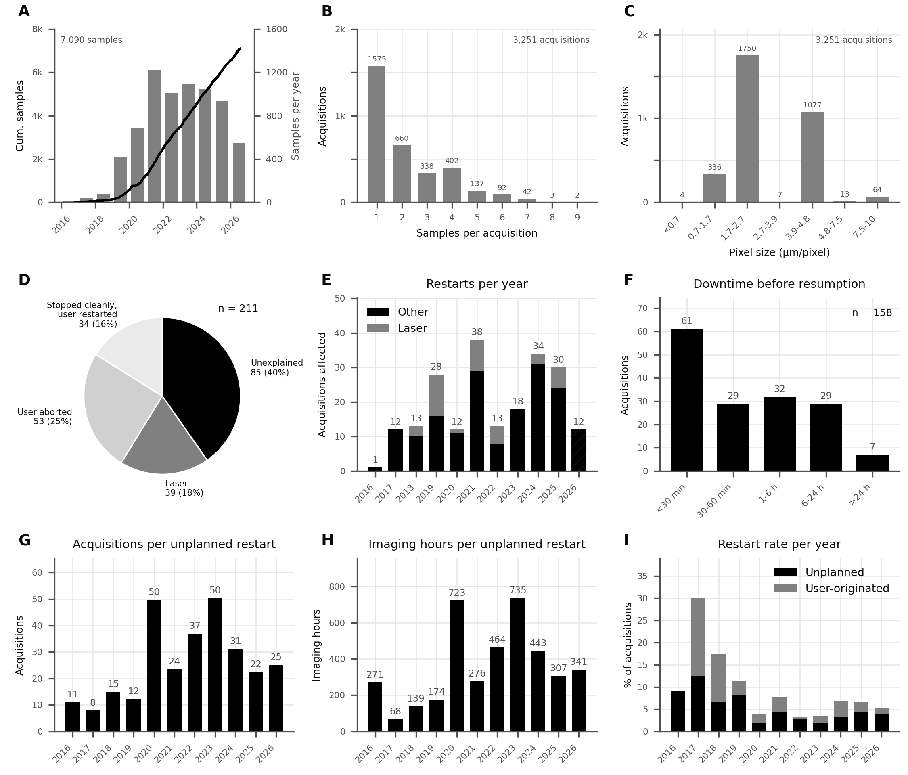
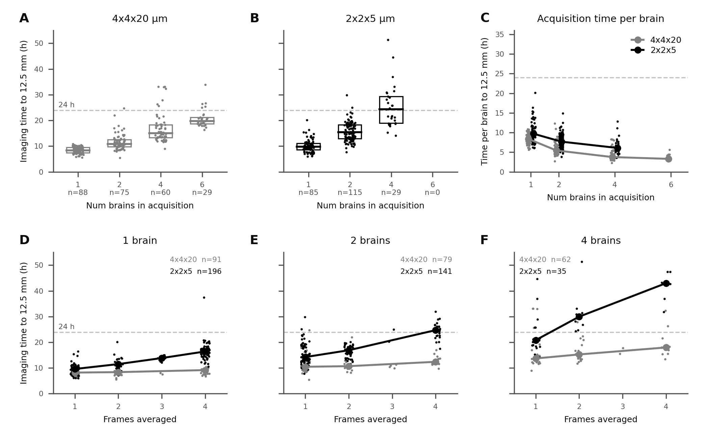

# BakingTray log analysis

This repository contains raw data and analyses of BakingTray log files associated with our methods preprint. The purpose of the analyses was to mine the metadata from all available BrainSaw acquisitions on our storage platform in order to obtain historical throughput and reliability statistics. We analysed acquisitions from the three BrainSaw systems at the Sainsbury Wellcome Centre (SWC) between October 2016 and July 2026. The key outputs of these analyses are the acquisition-statistics figure of the BakingTray manuscript and its supplementary timing figure (both reproduced below). Further details can be found in [details.md](details.md).

The analysis code was written interactively with AI assistance and reviewed carefully. AI assistance was particularly useful for these analyses as there was enormous heterogeneity in how acquisitions were organised across the storage platform. There were duplications of whole datasets, resumed acquisitions with multiple copies of the main "recipe" log file, un-processed acquisitions that had to be discarded, "test" acquisitions that similarly required exclusion and so on. AI helped to quickly uncover these and other issues. To ensure robustness, every key quantity is re-derived from the raw logs by an independent route (`raw/09_make_readme_figures.py`); the checks are shown in [validation.md](validation.md).


## Data

Each imaged sample has two metadata files. The recipe file (`recipe_<sample>_<YYMMDD>_<HHMMSS>.yml`) records the start time, imaging settings and microscope. The acquisition log (`acqLog_<sample>.txt`) is a running log of the acquisition, one entry per physical section giving the imaging time, number of tiles, and the cutting time. The original data came from four overlapping storage locations, which were merged into one tree, `MERGED_LOGS` (20,985 files, 1.3 GB), which ships packed as `raw/MERGED_LOGS.tar.bz2`.
The imaging data themselves were not used.


## What we found

| Quantity | Value |
|---|---|
| Samples | 7,090 |
| Acquisitions | 3,251; half contained two or more samples |
| Imaging time | 43,669 h; 119.4 million tile positions |
| Acquisitions that ran to completion | 94.5% (3,071) |
| Restarts | 211, in 180 acquisitions |
| User-originated restarts | 87: 53 user aborts, 34 stopped normally then restarted |
| Unplanned restarts | 124: 39 laser faults, 85 unexplained |
| Unplanned restarts, 2020–2026 | about 1 per 34 acquisitions, or 1 per 470 imaging hours (mean of yearly values) |

No laser fault was logged after December 2025. Unexplained stops have no error text in the log; 45 of the 85 were resumed within an hour and 40 sat for an hour or more. The supplementary figure reports acquisition time for 582 runs (738 in panels D–F) since January 2020 on the BrainSaw and NeuroVision microscopes, scaled to 12.5 mm of tissue; rat brains and 40 single-sample runs holding more than one mouse brain's worth of tissue are left out (see [Timing cohort](#definitions)).


## Figures

The following are the figures that were derived from the data and used in the manuscript. Both figures are drawn from the tables in `raw/derived_data/` by the scripts beside them (see [Running](#running)). Captions are as in the paper.

### Acquisition throughput and reliability



**Acquisition throughput and reliability of the three microscopes at the SWC.**
Data before 2018 were acquired by one of the microscopes now at the SWC before it was moved there.
Graphs show data up to mid-July 2026.

- **A.** Line shows the cumulative number of imaged samples as a function of time (left axis). Grey bars show the total number of samples imaged each year (right axis).

- **B.** BakingTray supports multiple samples per acquisition. Panel shows the distribution of the number of samples imaged in a single acquisition, e.g. in 139 acquisitions six or more samples were imaged.

- **C.** Lateral (X/Y) pixel size at which these acquisitions were conducted. Around 2 µm/pixel is suggested for cell counting, and 4–8 µm/pixel for mapping electrode tracks and fibre tracks.

- **D.** In 211 cases acquisitions were restarted for some reason (restarts after five or fewer sections, which reflect setup errors, are not counted; see [Definitions](#definitions)). On 53 occasions the user manually aborted then restarted the acquisition. On 34 occasions the acquisition stopped as planned but was then restarted. On 39 occasions BakingTray stopped acquiring because the laser was reported as not running. In the remaining 85 cases the acquisition stopped for an unknown reason and was then restarted.

- **E.** Restarts by year. Restarts due to the laser are highlighted; these were more likely due to a bug in the serial communications protocol (fixed in 2026) than to a true laser problem.

- **F.** The time between an acquisition stopping and its restart. User-aborted restarts are not included, as typically those were restarted immediately.

- **G.** A time-to-failure measure: the number of acquisitions per unplanned restart in each year.

- **H.** The data in G in units of acquisition hours per unplanned restart.

- **I.** Restart rate per year. User-originated restarts followed a stop that the user requested or that BakingTray made by design (a manual abort, reaching the requested number of sections, or finding no tissue). Unplanned restarts followed a stop forced by an error, such as a laser fault, a hard crash of MATLAB or a power cut. The years 2016–2019 had fewer acquisitions, so their rates are less reliable, and BakingTray was under heavier development at that time.

  

### Acquisition time (supplementary)



**Acquisition time statistics.**
Data come from mouse brain acquisitions performed from January 2020 onwards on the two rigs at the SWC running 8 kHz resonant scanners.
We did not include acquisition time data from our third microscope, which is equipped with a slower 4 kHz resonant scanner.

- **A & B.** Total acquisition time for a mouse brain normalised to 12.5 mm of imaged depth, plotted against the number of brains in the acquisition, for the two most common voxel configurations: 4 × 4 × 20 µm (A, grey) and 2 × 2 × 5 µm (B, black).
- **C.** Data from A and B normalised by the number of brains in the acquisition. Points are individual acquisitions, lines join the medians. Acquisition time per brain falls as more brains are added, mostly due to lower cutting time per brain.
- **D–F.** Acquisition time normalised to 12.5 mm of imaged depth plotted against the number of averaged frames, separately for acquisitions of one brain (D), two brains (E) and four brains (F). Points are individual acquisitions, lines join medians of averaging levels represented by at least five acquisitions.

Throughout, points are jittered horizontally to reduce over-plotting, and the dashed line marks 24 h. Panels A–C include only data with ≤ 4 frames of averaging for the lower-resolution data and ≤ 2 frames for the higher-resolution data. Rat brains and single-sample runs holding more than one mouse brain's worth of tissue are excluded (see [Timing cohort](#definitions)). Sample sizes are n = 582 acquisitions (A–C) and n = 738 acquisitions (D–F). The variability in acquisition times is due to factors such as cutting speed, the amount of agarose being cut, frame averaging, and variability in autoROI behaviour.


## Definitions

**Sample.** One sample directory.
A multi-sample acquisition is cropped after imaging into one directory per sample, each with a copy of the recipe file. These copies of the recipe file had their file names modified to reflect the sample name and, in almost all cases, the sample name was also changed in the body of the file. We kept one recipe file per sample directory (ignoring BakingTray's backup recipes and the extra recipe it writes on each restart), then removed copies of the same sample stored elsewhere and uncropped recipes left in the parent directory. The sample name comes from the file name, because the name inside the file was not always updated on cropping.

**Acquisition.** All samples imaged together, identified by microscope and start time.

**Restart.** A `STARTING NEW ACQUISITION` line after the first in an acquisition log, or a run resumed into a new directory (below). Each restart is identified by microscope and time, so it is counted once however many co-imaged samples' logs recorded it. It is classified from the lines before it, back to the previous start: user abort (`abortAfterSectionComplete`), stopped normally (`FINISHED AND COMPLETED ACQUISITION` or `Found no tissue`), laser fault (`STOPPING ACQUISITION DUE TO LASER` or `LASER NOT RUNNING`),
or unexplained. The first two are user-originated, the last two unplanned.

**Test run.** An acquisition that cut five or fewer sections in total, e.g. one plane imaged at several laser powers, or a one-section run before the real one. It is not counted as an acquisition or a sample (7 runs).

**Setup restart.** A restart after five or fewer sections had been cut since the acquisition started or was last restarted, whatever the reason. These are corrections of setup errors and are not counted (100 of 311).

**Resumed into a new directory.** Occasionally a user resumed a run under a new name (e.g. `AB_rab0405` → `AB_rab0405_NEWLASER`).
Two consecutive runs on one microscope are one acquisition if the second began at the depth where the first would have cut its next section. They are also one acquisition if the second began within 24 h of the first ending, wrote to the same acquisition-PC directory or that name plus a suffix, and either continued the section numbering or followed a first run of fewer than 80 sections. There are 22 such pairs. Only the samples of the run with more samples are counted, so a first attempt that was never cropped does not replace the resumed run's cropped samples, and the stop between the runs is a restart.

**Imaging time.** The sum of the per-section durations printed in the log. This will exclude downtime between a stop and a restart.

**Timing cohort.** The acquisitions in the supplementary figure (`raw/08_build_timing_figure_data.py`): from January 2020, on BrainSaw or NeuroVision, in the 4 × 4 × 20 or 2 × 2 × 5 µm voxel categories, at least 9.5 mm cut, and not rat brains. Rat brains are recognised by sample names starting with the initials of users known to image rats (VP, CM or TBM in any lab; AR, ATL, DO, EC, EM, HAA, LP or LSA in the Akrami lab), read from both the sample directory name and the recipe's sample ID. Brains are counted as the sample directories holding a copy of the acquisition log, so several brains left in one uncropped directory count as one. A run counted as one brain is therefore also excluded if its mean tile positions per section exceed 1.6 times the median of that value across single-brain runs in its voxel category (about 58 in both; two-brain runs have medians of 110 at 4 × 4 × 20 µm and 118 at 2 × 2 × 5 µm). 40 runs are excluded this way; they are listed in `timing_oversized_runs.csv`, and often the recipe's sample ID names several animals (e.g. `SL_1095774_1111674_1111678_1112061`). They remain single samples in the sample counts, since how many brains they held is not known.


## Code layout

```
acquisition_stats.py            draws the main figure  -> acquisition_stats.eps/.png
acquisition_timing.py           draws the timing figure -> acquisition_timing.eps/.png
validation.md                   the checks on the analysis, with plots
details.md                      tables and further detail
raw/
  MERGED_LOGS.tar.bz2           the raw logs, packed
  01_dedup_merged_logs.py       one recipe per sample; finds runs resumed into a new directory
  02_count_acquisitions.py      groups samples into acquisitions
  03_classify_restarts.py       finds and classifies restarts; sets aside setup restarts
  04_investigate_unknown.py     console summary of the unexplained restarts (optional)
  05_extract_acquisition_metrics.py   imaging hours, tiles and sections per acquisition
  06_build_figure_data.py       tables for the main figure
  07_extract_acquisition_timing.py    per-section time series with each run's settings
  08_build_timing_figure_data.py      selects the timing-figure cohort
  09_make_readme_figures.py     independent validation (not part of the pipeline)
  write_derived_data.py         runs 01-08 in order
  recipes.py, resumes.py        shared helpers for the pipeline
  paths.py                      the only place a path is set
  figure_style.py               palette and panel helpers for acquisition_stats.py
  derived_data/                 every table the pipeline writes; start any further analysis here
  readme_images/                the plots in validation.md
```

All analytical decisions are made in `raw/`. The two figure scripts read only CSV files from `raw/derived_data/` and do no analysis, so a panel cannot disagree with its table.


## Running the code

Nothing needs to be run: the tables and figures are in the repository. To redraw a figure (about a second each; needs `numpy` and `matplotlib`):

```bash
python3 acquisition_stats.py
python3 acquisition_timing.py
```

To rebuild every table from the logs (about 75 s; standard library only):

```bash
cd raw
tar -xjf MERGED_LOGS.tar.bz2
python3 write_derived_data.py
python3 09_make_readme_figures.py    # optional: validation plots
```

A rebuild reproduces `derived_data/` byte for byte and draws no figures; redraw them as above. To keep the logs elsewhere, set `MERGED_LOGS=/path/to/MERGED_LOGS`. `write_derived_data.py --help` lists its options.


## Limitations

* Unexplained stops are not diagnosed; some are probably faults and some might be a user action.

* Resumes into a new directory are found by cutting depth or directory name. A run resumed under an unrelated name, and not at the depth where the first run stopped, is counted as a new acquisition with no restart.

* Only surviving files are counted. 3,245 of 3,251 acquisitions (99.8%) have an acquisition log; the rest contribute no hours.

* A multi-sample acquisition that was never cropped into separate directories counts as one sample, so the sample count is conservative. Such runs are kept out of the timing figure by their tile count (see [Timing cohort](#definitions)), a rule that also drops some genuine single brains imaged with an unusually large area.

  


## Licence

Copyright © 2026 Sainsbury Wellcome Centre, University College London.
The code is released under the [MIT License](LICENSE).
The data, figures and documentation are released under [CC BY 4.0](LICENSE-data); please cite the BakingTray paper if you use them.
