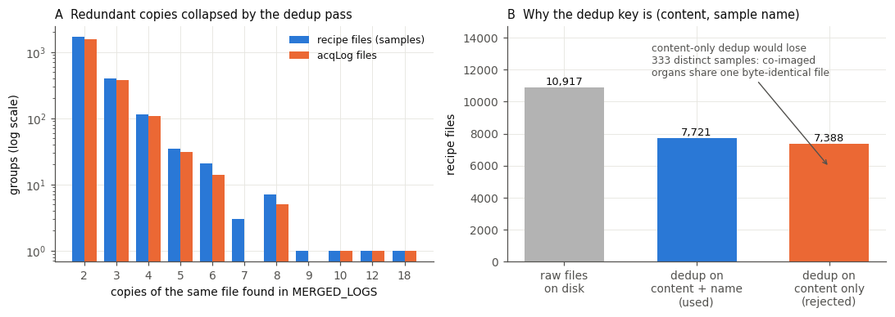
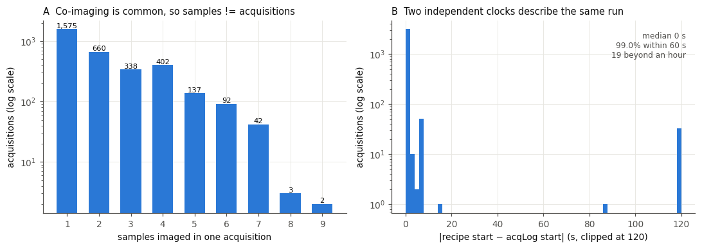
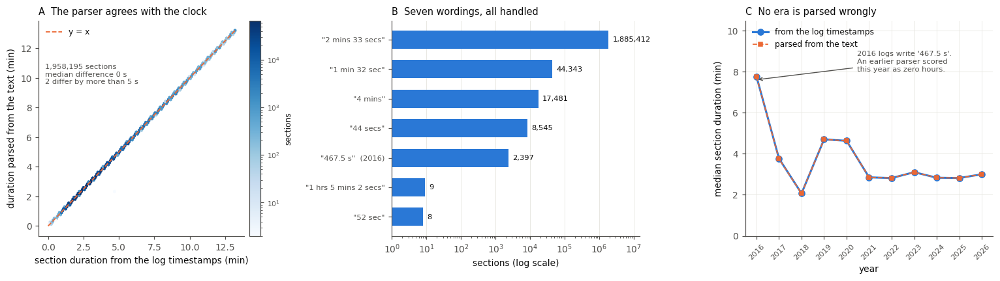
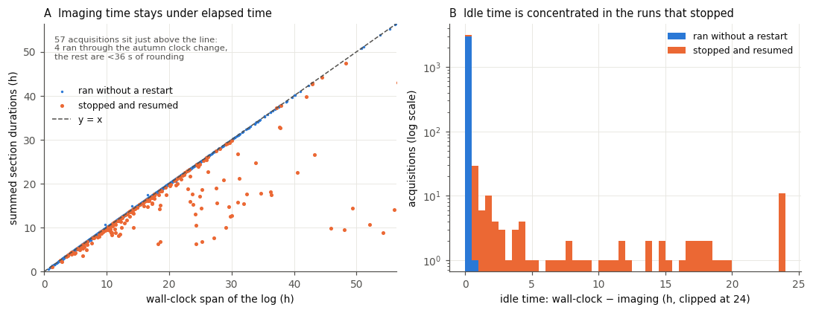
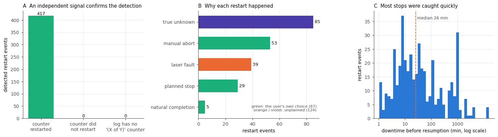
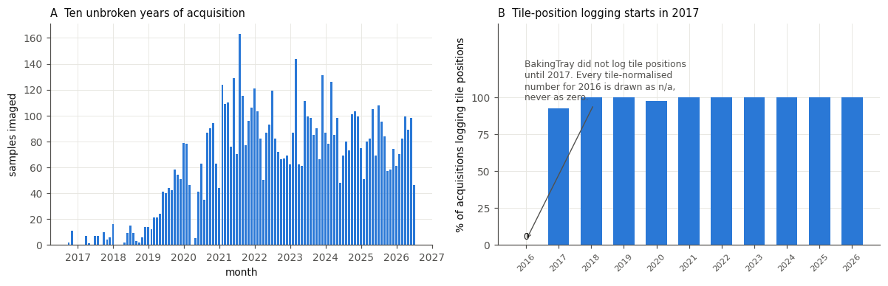
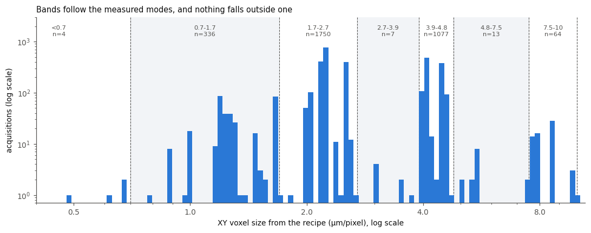
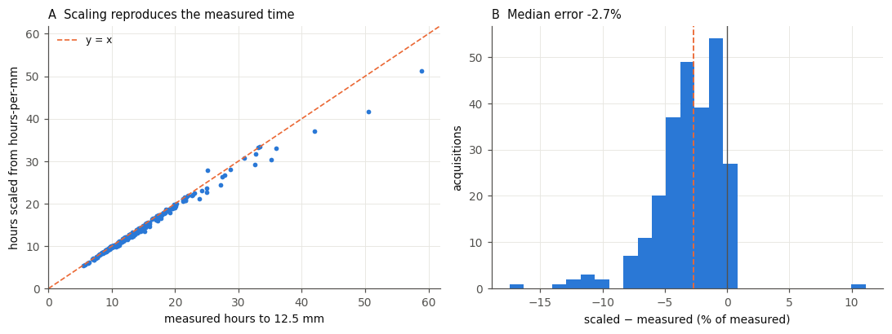

# Validation

The numbers in the paper come from parsing ten years of instrument logs, so we checked the parsing. Each plot below re-derives a quantity by a route the analysis pipeline does not use, and compares the two. If the pipeline were wrong, these plots would show it.
They are drawn by `raw/09_make_readme_figures.py`, which also prints every number quoted here:

```bash
cd raw
python3 09_make_readme_figures.py
```

Terms such as sample, acquisition and restart are defined in the [README](README.md#definitions).


## 1. Deduplication



The logs were gathered from four overlapping storage locations, so many files exist in several copies (A). A file was treated as a copy only if both its content and its sample name matched. Content alone is not enough: co-imaged samples often share byte-identical files, and deduplicating on content alone would have merged 333 distinct samples (B). Further rules reduce the 7,721 unique recipe files to 7,090 samples (e.g. one recipe per sample directory; see [details.md](details.md#deduplication)). The script re-hashes every file, re-applies these rules and reproduces the pipeline's list of samples exactly.


## 2. Grouping samples into acquisitions



Samples imaged together form one acquisition, and about half of all acquisitions held two or more samples (A). The start time of an acquisition is recorded independently in the recipe file and in the acquisition log. All 3,245 acquisitions with a log match an acquisition found from the recipes (B). The median difference is 0 s and 99.0% agree within 60 s; the 19 that differ by over an hour had their recipe saved well before the run began.


## 3. Section durations



The log prints the time each section took, worded seven different ways over ten years (B). We compared every parsed duration with the difference between that section's own start and finish timestamps, which the parser never reads (A). Across 1,958,195 sections the median difference is 0 s and two differ by more than 5 s. The two measures agree in every year (C), including 2016, when durations were written as "467.5 s".


## 4. Imaging time



Imaging time is the sum of the section durations, so it excludes any time a stopped acquisition sat idle. It should therefore never exceed the time elapsed between the first and last lines of the log (A). 57 acquisitions exceed it slightly: four ran through the autumn clock change and the rest by at most 36 s, due to rounding. Idle time is found almost entirely in acquisitions that were stopped and resumed (B). In total, 43,669 h of imaging took 44,958 h of elapsed time.


## 5. Restarts



A restart is detected as a `STARTING NEW ACQUISITION` line after the first in a log. Independently, the section counter `(X of Y)` printed with each section resets to 1 whenever an acquisition starts. It reset at all 417 restarts found in the logs (A; counted per log file, so a restart of co-imaged samples appears once per sample). B shows the 211 restarts by cause, with setup restarts excluded, and C the downtime before each was resumed (median 26 min).


## 6. Coverage



Samples imaged per month, October 2016 to July 2026 (A). Few samples were imaged before 2019; data before 2018 come from one microscope before it moved to the SWC. The first major COVID lockdown is clearly visible in the data. BakingTray began logging the number of tile positions in 2017 (B), so rates per tile position are left blank for 2016 rather than drawn as zero.


## 7. Resolution bands



Panel C of the main figure groups acquisitions by lateral pixel size. The band edges were set from the measured pixel sizes rather than from nominal settings: the "1.6 µm" setting, for example, measures 1.648–1.690 µm. Every acquisition falls in a band.


## 8. Depth normalisation



The supplementary figure scales each acquisition's imaging time to 12.5 mm of tissue, and excludes acquisitions that cut less than 9.5 mm. For the 254 of 582 acquisitions that reached 12.5 mm, we compared the scaled time with the time actually taken to get there (A).
Scaling underestimates it by a median of 2.7% (IQR 1.0–4.2%; B), because the sections cut after 12.5 mm take less time than those before it.
